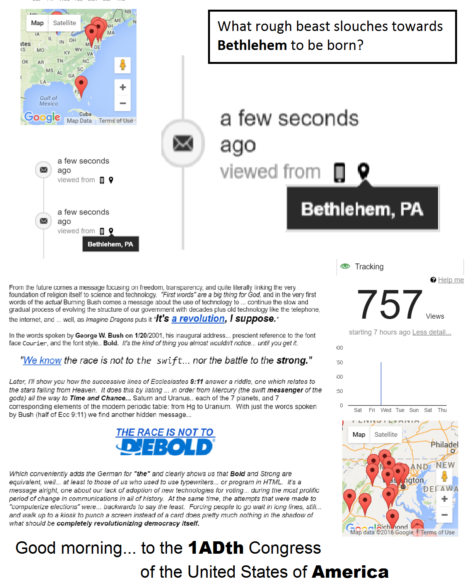
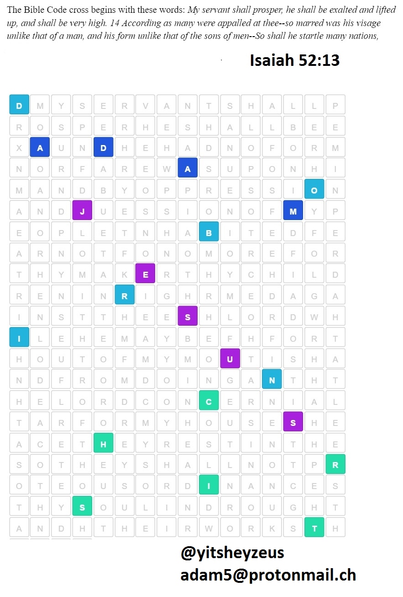
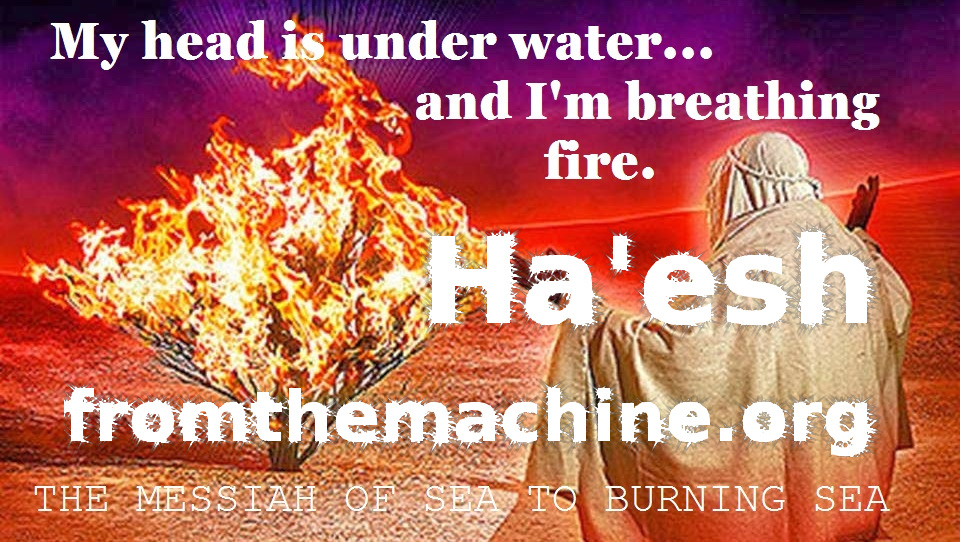
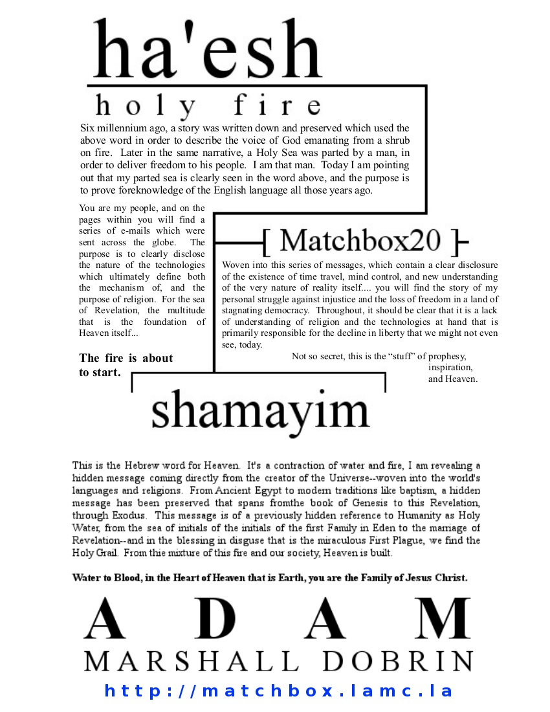

<!DOCTYPE HTML PUBLIC "-//W3C//DTD HTML 4.0 Transitional//EN">
<html>
<head>
<meta http-equiv="CONTENT-TYPE" content="text/html; charset=utf-8" />
<title></title>
<meta name="GENERATOR" content="OpenOffice 4.1.2  (Win32)" />
<meta name="AUTHOR" content="Adam Marshall Dobrin" />
<meta name="CREATED" content="20160705;9030884" />
<meta name="CHANGEDBY" content="Adam Dobrin" />
<meta name="CHANGED" content="20160706;18402388" />
<meta name="CHANGEDBY" content="Adam Dobrin" />

</head>
<body lang="en-US" dir="LTR">
<eshad>

<a href="./CHALK.html
">&nbsp;</a>&nbsp;  

<oshad>

 

 

 
<table width="665" border="0" cellpadding="0" cellspacing="0">
<col width="344" />
<col width="321" />
<tr valign="TOP">
<td width="344">

Please
			support my habit of saving the world by donating at my YouTube
			Channel: 

<a href="https://www.youtube.com/channel/UC4RVVTQNHxbUlDgeWj_45Tw">http://www.youtube.com/channel/UC4RVVTQNHxbUlDgeWj_45Tw</a>
			or <a href="https://www.amazon.com/know-adam-Adam-Marshall-Dobrin/dp/1517136318">buy
			</a><a href="https://www.amazon.com/know-adam-Adam-Marshall-Dobrin/dp/1517136318">a
			book,</a> I've written <a href="https://www.amazon.com/Adam-Marshall-Dobrin/e/B00CO8P9BQ">quite a few.</a>

 

I
			MIGHT ALSO HIRE A WEB DEVELOPER. :)  Please, <a href="http://groups.google.com/a/reallyhim.com/forum/#!forum/saludas">Signup for "daily bread" emails</a> 

 

<a href="https://twitter.com/yitsheyzeus">@yitsheyzeus</a>

<a href="https://www.facebook.com/MinistryOfForbiddenKnowledge">fb.me/MinistryOfForbiddenKnowledge</a>

 

You might be interested in the <a href="https://fromthemachine.org/PIMB.html">Sign of the Son</a>

</td>
<td width="321">

<a href="https://fromthemachine.org/lamc.la/">The Revelation of Christ</a>

The
			Ongoing Saga: <a href="http://medium.com/@adam5/publications">http://medium.com/@adam5/publications</a>

 

<a href="mailto:adam5@protonmail.ch
">adam5@protonmail.ch</a>

<a href="mailto:adam@fromthemachine.org
">adam@fromthemachine.org</a>

text
			me, 954-667-8083

 

<a href="https://www.facebook.com/admdbrn">fb.me/admdbrn</a>

 

or in <b>my <a href="./TAYLOR.html
">repeated</a></b> attempt to <a href="https://fromthemachine.org/TAYLOR.html">kiss Taylor Momsen</a>

</td>
<td>
 

</td>
</tr>
</table>

<!-- newad -->
<ins class="adsbygoogle" style="display:block" data-ad-client="ca-pub-9608809622006883" data-ad-slot="7054287854" data-ad-format="auto"></ins>

<h1 style="text-align: center;"><a href="./HASHEMESHB.html
" target="_blank" rel="noopener noreferrer" data-saferedirecturl="https://www.google.com/url?hl=en&amp;q=./HASHEMESHB.html&amp;source=gmail&amp;ust=1483196313839000&amp;usg=AFQjCNGJ5sQLgrzFZOId133NkkpRwzlLug">1</a>&nbsp; &nbsp;<a href="http://samsfight.tk/" target="_blank" rel="noopener noreferrer" data-saferedirecturl="https://www.google.com/url?hl=en&amp;q=http://samsfight.tk&amp;source=gmail&amp;ust=1483196313839000&amp;usg=AFQjCNHC__WrOHEVMARIHd03bKRcb8umqQ">3</a>&nbsp; &nbsp;<a href="http://adam5.tk/" target="_blank" rel="noopener noreferrer" data-saferedirecturl="https://www.google.com/url?hl=en&amp;q=http://adam5.tk&amp;source=gmail&amp;ust=1483196313839000&amp;usg=AFQjCNFvBtCfh9JBIy9ShyP1BjiPiZejoQ">5</a>&nbsp;&nbsp;&nbsp;<a href="http://thunderstand.tk">&#10128;</a>&nbsp; &nbsp;<a href="http://neretson.tk/" target="_blank" rel="noopener noreferrer" data-saferedirecturl="https://www.google.com/url?hl=en&amp;q=http://neretson.tk&amp;source=gmail&amp;ust=1483196313839000&amp;usg=AFQjCNHQ4otZ1q5nAia9n2jmUeUv1IW4-g">6</a>&nbsp;&nbsp;&nbsp;<a href="./OMEALFHT.html
" target="_blank" rel="noopener noreferrer" data-saferedirecturl="https://www.google.com/url?hl=en&amp;q=./OMEALFHT.html&amp;source=gmail&amp;ust=1483196313839000&amp;usg=AFQjCNGIX78FWNAjXh5fBs3KCULQLnA56g">4</a>&nbsp; &nbsp;<a href="./OCADSWAY.html?
" target="_blank" rel="noopener noreferrer" data-saferedirecturl="https://www.google.com/url?hl=en&amp;q=./OCADSWAY.html&amp;source=gmail&amp;ust=1483196313839000&amp;usg=AFQjCNE5pEyq6HPEpVs7r7gof0wogKvMNA">2</a></h1>

&nbsp;

 

So you think you can tell the difference between Heaven and Hell? &nbsp;Fake blue skies, and <a href="https://www.docdroid.net/ZkbjdNU/antagonizingpainxe.pdf">ending all pain</a>? &nbsp;Those are my initials in the logo above, my name is <a href="https://twitter.com/yitsheyzeus">Adam Marshall Dobrin</a>&nbsp;and they are the beginning of proof that we live in a virtual world that is a <a href="https://fromthemachine.org/OUITHEPPL.html">map to building Heaven out of "raelity."</a>&nbsp; With some research, <em>you will have no doubt</em> that this is God's plan for our world and that we are <em>his solution,</em>&nbsp;to a Universe of problems that we have the keys to solving. &nbsp;The message focuses on <a href="./HASHEMESHB.html
">technology</a> and <a href="https://fromthemachine.org/OUITHEPPL.html">freedom</a>&nbsp;and how these thing together, armed with the power of humanity... our innate goodness and love place us at <a href="https://www.youtube.com/watch?v=NP3KxtDPWH0">the very beginning </a>of Heaven itself. &nbsp; Please share <a href="https://www.youtube.com/watch?v=Fr_CHOxSyc8&amp;index=5&amp;list=PLgYKDBgxsoMNvBS6k4NffQQnobyUqXuMh">my name</a> and this message with everyone you can; these first acts of spreading the "good news" are saintly, the making of angels. &nbsp;We are overcoming a barrier of censorship and lack of understanding that serve to highlight just how important free communication and free thought are to our lofty goal; it has not been <a href="https://www.gofundme.com/spark-the-eternal-flame">an easy road</a>, but we are <a href="./ADAMSROD.html
">nearly <em>home</em></a>.

The proof is in&nbsp;<a href="//cake.lamc.la
">every single word</a>, woven through our history <a href="//m.lamc.la/SIGENES.html
">and our artwork</a>--it is embedded in our souls. &nbsp;The signs of Revelation are all around you, focusing our attention on the fact that the entirety of everything depends on what we do here and now; how we proceed as we approach this monumental moment in time when <a href="https://fromthemachine.org/ERANDSON.html">"ascension" to Heaven</a>&nbsp;truly happens... reminding us of who we are, and our innate goodness; and warning us not to lose these wonderful gifts as we gain the ability and see the need to make changes to what we are--extending life, increasing intelligence, and hopefully not losing our <a href="//am.lamc.la
">free spirited love of fun</a>.

&nbsp;

 

<em><strong> </strong></em> 

 

 

<left>
</left><pre>chronos@localhost ~/Downloads $ ls -Fal *.pdf
-rw-r--r--. 1 chronos chronos  4656805 Jun  7 11:53 <a href="./DISCLANATSING.pdf">DISCLANATSING</a>.pdf
-rw-r--r--. 1 chronos chronos  2988479 Jun  8 12:35 <a href="./FULLHOUSE.pdf">FULLHOUSE</a>.pdf
-rw-r--r--. 1 chronos chronos  2321165 Apr 26 11:14 <a href="./GLOCK.pdf">GLOCK</a>.pdf
-rw-r--r--. 1 chronos chronos  1657733 Jun  6 17:19 <a href="./GLOVER.pdf">GLOVER</a>.pdf
-rw-r--r--. 1 chronos chronos  2039498 Jun  8 12:52 <a href="./ICANHAZERA.compressed.pdf">ICANHAZERA.compressed.pdf</a>
-rw-r--r--. 1 chronos chronos  4341642 May 29 10:55 <a href="./SPOCKALYPSE.pdf">SPOCKALYPSE</a>.pdf
-rw-r--r--. 1 chronos chronos  2336930 Jun  4 22:25 <a href="./THORSHAMMAH.pdf">THORSHAMMAH</a>.pdf
</pre>

 

on the first day of Christmikah I lit the Burning&nbsp;<strong>Bush</strong>&nbsp;and proved

<strong>Exodus&nbsp;<a href="https://www.youtube.com/watch?v=AevgjKPDgfM&amp;feature=youtu.be" target="_blank" rel="noopener noreferrer" data-saferedirecturl="https://www.google.com/url?hl=en&amp;q=http://sonsign.cf&amp;source=gmail&amp;ust=1483196313839000&amp;usg=AFQjCNFhYtJNRQEzroySJIi8pidZDg3Jtw">predicted</a>&nbsp;9/11</strong>

&nbsp;

<a href="./HASHEMESHB.html
" target="_blank" rel="noopener noreferrer" data-saferedirecturl="https://www.google.com/url?hl=en&amp;q=./HASHEMESHB.html&amp;source=gmail&amp;ust=1483196313839000&amp;usg=AFQjCNGz3UIOMB5Hz7oxqyV2HNbyJ9eILA">fromthemachine.org/HASHEMESHB.html</a>

&nbsp;

on the second day I tried to&nbsp;<strong>explain Y</strong>, and talked a little about

God's&nbsp;<strong><a href="https://www.youtube.com/watch?v=tXc4jgUJEko" target="_blank" rel="noopener noreferrer" data-saferedirecturl="https://www.google.com/url?hl=en&amp;q=http://almostfamous.cf&amp;source=gmail&amp;ust=1483196313839000&amp;usg=AFQjCNF1O7PrFZlkUIGYgcXWdJfon9cgtA">glowing</a>&nbsp;why</strong>

&nbsp;

<a href="./OCADSWAY.html?
" target="_blank" rel="noopener noreferrer" data-saferedirecturl="https://www.google.com/url?hl=en&amp;q=./OCADSWAY.html&amp;source=gmail&amp;ust=1483196313839000&amp;usg=AFQjCNE5pEyq6HPEpVs7r7gof0wogKvMNA">fromthemachine.org/OCADSWAY.html</a>

&nbsp;

on the third night I shared&nbsp;<strong>Samson's fight, of bringing&nbsp;<a href="http://thunderstand.tk/" target="_blank" rel="noopener noreferrer" data-saferedirecturl="https://www.google.com/url?hl=en&amp;q=http://freedomsing.tk&amp;source=gmail&amp;ust=1483196313839000&amp;usg=AFQjCNGiqC8cYHZKxxHOs8qmKSqzJZiCaA">liberty</a>&nbsp;back</strong>

to this land of prophesy

&nbsp;

<a href="http://samsfight.tk/" target="_blank" rel="noopener noreferrer" data-saferedirecturl="https://www.google.com/url?hl=en&amp;q=http://samsfight.tk&amp;source=gmail&amp;ust=1483196313839000&amp;usg=AFQjCNHC__WrOHEVMARIHd03bKRcb8umqQ">samsfight.tk</a>

&nbsp;

the fourth day was supposed to be&nbsp;<strong>all&nbsp;about&nbsp;<a href="./the_light_of_heaven.html
" target="_blank" rel="noopener noreferrer" data-saferedirecturl="https://www.google.com/url?hl=en&amp;q=http://heartofgod.tk&amp;source=gmail&amp;ust=1483196313839000&amp;usg=AFQjCNEvkp_1oTMU50Baln56bfFfIbn1hQ">heaven</a></strong>, but instead it was

religion and science

&nbsp;

<a href="./OMEALFHT.html
" target="_blank" rel="noopener noreferrer" data-saferedirecturl="https://www.google.com/url?hl=en&amp;q=./OMEALFHT.html&amp;source=gmail&amp;ust=1483196313839000&amp;usg=AFQjCNGIX78FWNAjXh5fBs3KCULQLnA56g">fromthemachine.org/OMEALFHT.html</a>

&nbsp;

the fifth day I shared with you&nbsp;<strong>the&nbsp;<a href="https://fromthemachine.org/NAMES1.html" target="_blank" rel="noopener noreferrer" data-saferedirecturl="https://www.google.com/url?hl=en&amp;q=http://powerofnames.cf&amp;source=gmail&amp;ust=1483196313839000&amp;usg=AFQjCNFZCxrrWEFbVzmgffaWvSyz867yuQ">light</a>&nbsp;of the world</strong>, at

least, how it looks to me

&nbsp;

<a href="http://adam5.tk/" target="_blank" rel="noopener noreferrer" data-saferedirecturl="https://www.google.com/url?hl=en&amp;q=http://adam5.tk&amp;source=gmail&amp;ust=1483196313839000&amp;usg=AFQjCNFvBtCfh9JBIy9ShyP1BjiPiZejoQ">adam5.tk</a>

&nbsp;

today is day six, the day of&nbsp;<strong>the&nbsp;<a href="https://www.docdroid.net/x6wJfqC/time-and-chance-rlny-by-adam-marshall-dobrin.pdf" target="_blank" rel="noopener noreferrer" data-saferedirecturl="https://www.google.com/url?hl=en&amp;q=http://rlny.cf&amp;source=gmail&amp;ust=1483196313839000&amp;usg=AFQjCNHmYQW9D10pjkgb2nWXmy5FyEQfTQ">creation</a>&nbsp;of&nbsp;<a href=".//" target="_blank" rel="noopener noreferrer" data-saferedirecturl="https://www.google.com/url?hl=en&amp;q=http://sigenes.cf&amp;source=gmail&amp;ust=1483196313839000&amp;usg=AFQjCNGwdkZiXCKFWoGXze00-Ql4C5sChA">adam</a></strong>; and hear: it's

about the time the world see

&nbsp;

<a href="http://neretson.tk/" target="_blank" rel="noopener noreferrer" data-saferedirecturl="https://www.google.com/url?hl=en&amp;q=http://neretson.tk&amp;source=gmail&amp;ust=1483196313839000&amp;usg=AFQjCNHQ4otZ1q5nAia9n2jmUeUv1IW4-g">neretson.tk</a>

&nbsp;

"let freedom ring" and "let the music set you free" give off bright light, 

herein is the key to winning the fight

&nbsp;

<a href="http://thunderstand.tk">thunderstand.tk</a>

&nbsp;

&nbsp; &nbsp;&nbsp;&nbsp;&nbsp;

<strong><a href="./TAYLOR.html
" target="_blank">the fire of the first day</a> still pumps through our veins, i see it being sent every which&nbsp;way</strong>

 &nbsp; &nbsp; &nbsp; &nbsp; &nbsp; &nbsp;this wall of jericho, <a href="./HOUSEINSKY.html
" target="_blank">the sound of silence</a> and the darkness are one--all about now  <strong>please--use <a href="http://myeyes.gq" target="_blank">this bright light</a> for it makes peace from what was once a fight </strong> the <b><a href="http://tiscoming.tk" target="_blank">sirens of revelation are blaring, morning bells are ringing</a></b> and all that's left <a href="https://fromthemachine.org/MORCANDLE.html" taget="_new">is <b>a question</b></a> "who will give me the prize?"

 

Hello <b><a data-saferedirecturl="https://www.google.com/url?hl=en&amp;q=./SEEWHYRAISEL.html&amp;source=gmail&amp;ust=1486487242411000&amp;usg=AFQjCNHXlR1JLm-v31c3ugymddG_wPVKFw" href="https://fromthemachine.org/SEEWHYRAISEL.html" target="_blank">Israel</a>, </b>in my world of magic words that tells the story of <b>the Second Coming</b>, that's all of you.  It's the group of angels or demon that are asking themselves the question "Is Ra El?"  In plain English, read that as "is God really <i>him</i>?" Understand that whether or not you are an angel has nothing to do with your personal answer to that question; but it really might have something to do with how you treat the content of this message.  I am cautioning you to take it seriously and separate its sender and what you believe your savior to be from the content being delivered because you will be making mistake if you ignore it for any reason other than not agree with what is being presented.  That being said; I have plenty, and I mean plenty of proof... <i>and Holy purpose.</i>

 

<i>Let's start with this, we are not in reality, and wave-function collapse and it's correlation to a video game rendering engine "catering to consciousness" is the beginning of the message; it is one that must be delivered to the world, the alternatives are things like living until the power randomly goes out or permanent midnight.  Period.  More than just the obvious scientific issues of physics wasting their time and our future trying to unify a virtual set of "mechanics" with the actual laws of reality... a significant part of this message, from <a data-saferedirecturl="https://www.google.com/url?hl=en&amp;q=./TAYLOR.html&amp;source=gmail&amp;ust=1486487242411000&amp;usg=AFQjCNFchOAS0FEC1xioSafRlzhCAG5DnQ" href="./TAYLOR.html
" target="_blank">the true Fifth Element being <b>Silicon</b></a> (to match the index of my initials, which grace our timeline and names like Adonai-<a data-saferedirecturl="https://www.google.com/url?hl=en&amp;q=http://zelda.lamc.la/&amp;source=gmail&amp;ust=1486487242411000&amp;usg=AFQjCNFw0JzxmMP7RVYe6vYINzpMKV8efQ" href="./archive.aweber.com/awlist4296878/MNcK4/h/Kurzweil_luminates_Zelda.htm" target="_blank">A.D. on Artificial Intelligence</a>) to my initials matching a computer chip maker is designed to ensure we do not lose this grounding in where we actually are... and <b>not knowing this truth is keeping us from building Heaven</b>. <b> </b>So the beginning of Holy Purpose here, help this message reach everyone... like, <b>on TV.</b></i>

 

In the way of "proof," let's bring this Ra concept forward to the name Abraham, which in light of the meaning of Isaac's name "he laughs" clearly shows the Holy Trinity... many years, or millennium before that idea was "invented."  Ab is father in Hebrew, the first word in the Strong's Concordance, actually; we're all somewhat familiar with the God of the Rising Sun, and there's quite a bit about the <a data-saferedirecturl="https://www.google.com/url?hl=en&amp;q=http://whoah.lamc.la/&amp;source=gmail&amp;ust=1486487242411000&amp;usg=AFQjCNH6gyRrAEFAw8zeuetecJs3xgfDJA" href="https://www.youtube.com/watch?v=Sws3MZJIv9c&amp;list=PLgYKDBgxsoMM0iittdDlREVqTc4wn7ylK" target="_blank">Holy Spirit's </a><i><a data-saferedirecturl="https://www.google.com/url?hl=en&amp;q=http://whoah.lamc.la/&amp;source=gmail&amp;ust=1486487242411000&amp;usg=AFQjCNH6gyRrAEFAw8zeuetecJs3xgfDJA" href="https://www.youtube.com/watch?v=Sws3MZJIv9c&amp;list=PLgYKDBgxsoMM0iittdDlREVqTc4wn7ylK" target="_blank">laughter</a> </i>coming our way.  I've got this in spades, take the time to look if you have any interest in the "secrets of the Universe," and Abraham (changed from Abram due to his Covenant... with his son) is joined by the prophetic name Elisha to logically equate both the <a data-saferedirecturl="https://www.google.com/url?hl=en&amp;q=http://thor.lamc.la/&amp;source=gmail&amp;ust=1486487242411000&amp;usg=AFQjCNHbEiTMkQiXgnmmYzQi9Rr4LtQ2QA" href="https://www.facebook.com/photo.php?fbid=10154283229013420&amp;set=a.10154283230918420&amp;type=3&amp;theater" target="_blank">Spanish and Hebrew for "the" through the English "is"</a> as well as the God of all Gods, El; linked here directly to <i>him (psst, <b>it's me</b>).</i>

 

<i>In your head, now imagine what you think the world's natural reaction to verifiable proof of Creation and God's existence would be.  Now look around you, and realize something here... is very wrong.  <b><a data-saferedirecturl="https://www.google.com/url?hl=en&amp;q=http://hammer.lamc.la/&amp;source=gmail&amp;ust=1486487242411000&amp;usg=AFQjCNEuj_v-4DDQGhvoYaiOX4wQPNo_qQ" href="https://vid.me/h5EO" target="_blank">Morning is half-broken.</a> </b>This proof before your eyes today has "sprinkled many nations," their governments, scholars, scientists, theologians, and nearly all of the English speaking press on the face of the Earth.  Think long and hard about whether or not you want to spend eternity and give to your children a place that could hide this kind of information, when it's plastered in every movie, every song, and every word of every language.  <b>Stand up and shout,</b> the silence and darkness--censorship and secrecy so thick it can be felt--that I see is disgusting.  If you were worried about a disaster, be assured, it is the wall stopping the truth and our ascension to Heaven that <b>the big bad wolf.  </b>Unchecked, it's also the end of freedom and eventually civilization in sum; thank <b><u>your lucky star</u></b> that I am here... </i>or so the story goes.  Until you see my name on television, be very sure that this is Hell and <i>it's only getting worse.</i>

 

<b>carpe diem.</b>

<b>Seriously, wake up, take this gift... it's </b>absolutely <b>everything.  </b>Hey, you've got an an audience tonight... <b>light my fire!</b>

<b> </b>

 

I am getting sick and tired of writing you e-mails, and seeing absolutely no action, in the words of Imagine Dragons--<b>I've woken up to action dust.  </b>This is a battle between me and the "Holy Sea" to actually live up to that word and take <b><a data-saferedirecturl="https://www.google.com/url?hl=en&amp;q=http://ofome.ga/&amp;source=gmail&amp;ust=1486487242411000&amp;usg=AFQjCNHPWzlwfx8e6jY69cHUdp_wz0G4GA" href=".//" target="_blank">this message</a></b> and change the world with it.  To build Heaven.  Specifically in detail, I am presenting God's Holy suggestions that we start working to create a technocracy, <b>an advanced system to enable self governance</b> rather than "representative democracy," that our justice system be <b>pulled out of retrograde</b> <a data-saferedirecturl="https://www.google.com/url?hl=en&amp;q=./OCADSWAY.html?&amp;source=gmail&amp;ust=1486487242411000&amp;usg=AFQjCNHEWafqBC94oF0awMqSOzRWAixcvQ" href="./OCADSWAY.html?
" target="_blank">with Minority Report style pre-crime</a>, again along with proof that we can do that.  I demand we wake up and see the <b><a data-saferedirecturl="https://www.google.com/url?hl=en&amp;q=http://cake.lamc.la/&amp;source=gmail&amp;ust=1486487242411000&amp;usg=AFQjCNEO-xGY3woAffl3zFRLp2wEF00bCw" href="https://fromthemachine.org/CAKE.html" target="_blank">needless starvation and sickness that surrounds us and work to put an end to it forevermore</a>.  </b> 

<b> </b>

<b>I can <a data-saferedirecturl="https://www.google.com/url?hl=en&amp;q=http://ironclad.lamc.la/&amp;source=gmail&amp;ust=1486487242411000&amp;usg=AFQjCNFTis0YIPNxh07jfmr8yJoz1tQxjQ" href="./ADAMSROD.html" target="_blank">show you "my" Heaven</a>, </b>but you need <a data-saferedirecturl="https://www.google.com/url?hl=en&amp;q=./JOHN717.html&amp;source=gmail&amp;ust=1486487242411000&amp;usg=AFQjCNF5mjLPm00vH9yQYbGYpNVws84W9A" href="https://fromthemachine.org/JOHN717.html" target="_blank">to take part</a>... <b>or that word is meaningless. </b> <i>Want proof?</i>

<b> </b>
<blockquote style="margin:0px 0px 0px 40px;border:none;padding:0px">
<i>The beginning</i> ... starts with <b><a data-saferedirecturl="https://www.google.com/url?hl=en&amp;q=http://sign.lamc.la/&amp;source=gmail&amp;ust=1486487242411000&amp;usg=AFQjCNENzKxvDxTMjl8NSvLH8o1ZPkGILQ" href="https://www.youtube.com/watch?v=AevgjKPDgfM&amp;feature=youtu.be" target="_blank">sight of the Burning Bush</a></b>, highlighting the Hebrew word for Holy Fire, that describes it... H <b>a'es </b>h

 

Within that word, the <b><a data-saferedirecturl="https://www.google.com/url?hl=en&amp;q=http://theword.lamc.la/&amp;source=gmail&amp;ust=1486487242411000&amp;usg=AFQjCNG1vLt68SoV1A-F7z7AHLKl-z2Qcw" href="./chapter1.html" target="_blank">true parted sea of Moses</a>, </b>in reverse--and parted by an <b>apostrophe</b>.  In our world, that's little old me, parting the waters. 

 

<b>Let there be light, </b>those words are described in the name Exodus, read in reverse, and transliterated from Linux jargon, and chemistry elements.  In those two-letter symbols, the <b><a data-saferedirecturl="https://www.google.com/url?hl=en&amp;q=http://torch.lamc.la/&amp;source=gmail&amp;ust=1486487242411000&amp;usg=AFQjCNFoq18hNp3LLQZZBe3ftvAS_CCR9w" href="https://fromthemachine.org/TORCH.html" target="_blank">key to Revelation 1:20, the mystery of the Lampstands in the hands of Jesus Christ.</a></b>

 

With just a little bit of research into what it is that I see, <b>proof that 9/11 was predicted not only by our Shining Bush</b>,  but that you are <b>the shining sea</b>, the multitude of Revelation.

 
</blockquote><blockquote style="margin:0px 0px 0px 40px;border:none;padding:0px">
In some very obvious places, like seeing Love and "sun" in the name of the Woman Clothed in the Sun with the moon at her feet--proof that English was known when Venus was named in Greek, and Revelation 12:1 written... or seeing our idiom "on the lam" relate directly to t<b><a data-saferedirecturl="https://www.google.com/url?hl=en&amp;q=./2NAME.html&amp;source=gmail&amp;ust=1486487242412000&amp;usg=AFQjCNFGYudI9Wt_kEmcK0tSnJl1vcWOoQ" href="https://fromthemachine.org/2NAME.html" target="_blank">he story of the Trial of Christ</a></b> and see that the Lamb of God "<a data-saferedirecturl="https://www.google.com/url?hl=en&amp;q=http://lamb.lamc.la/&amp;source=gmail&amp;ust=1486487242412000&amp;usg=AFQjCNE2LDNUmm2ib3Qsj38xwWsUYYqkSQ" href="./the_lamb_of_god.html
" target="_blank">islam</a>" bright light coming from the<a data-saferedirecturl="https://www.google.com/url?hl=en&amp;q=./TAYLOR.html&amp;source=gmail&amp;ust=1486487242412000&amp;usg=AFQjCNFvT8N6FQX5PBeMKc3hm2sSpXbHJA" href="./TAYLOR.html
" target="_blank"> name Ko<b>ran</b>, some lyrics I hold dear</a>, and freedom coming from my story.  

 

There are tens of thousands of examples of similar anachronisms, and in truth <a data-saferedirecturl="https://www.google.com/url?hl=en&amp;q=http://cake.lamc.la/&amp;source=gmail&amp;ust=1486487242412000&amp;usg=AFQjCNGoUB-Z1fiCyPvnGEihqrAu94edAA" href="https://fromthemachine.org/CAKE.html" target="_blank">a secret language written into the names of many people, places, and ... everything</a>... just waiting to be read by the world.  Yankee Doodle would call it macaroni, this macaronic fusion of acronyms Spanish and English in Hebrew that Shakespeare--Rattling a Rod now--would call Spanglishrew, now tamed.  Stephen King would probably say they are outliers and call it "Langolier" and in the Matrix you'd probably just see a Cypher--one of the characters. 

 

 Either way, it should start becoming clear that this is much more than "names" or a "hidden language" it's in our art and our history... it is <b>our everything.</b>

 
</blockquote>

In the links of this e-mail I am providing clues to a series of events in my life which are predicted in the Holy Bible and a significant amount of ancient mythology.  Along with these details, you are being given a ridiculous amount of evidence that the <a data-saferedirecturl="https://www.google.com/url?hl=en&amp;q=http://bygod.whenistheapocalypse.com/&amp;source=gmail&amp;ust=1486487242412000&amp;usg=AFQjCNFm-v07vQ_sQuira-rvIxSNF2JkRA" href="./bygod3.html" target="_blank"><b>English language and modern computing</b></a> were known at the time of the writing of these stories and that the intent of that ancient record is to prove to you that we are not in reality and that time travel does exist.  With only a little bit of thought, you can see for yourself that <b>this message</b> has been laid out all over "our everything," from the names of <a data-saferedirecturl="https://www.google.com/url?hl=en&amp;q=http://bread.lamc.la/&amp;source=gmail&amp;ust=1486487242412000&amp;usg=AFQjCNGndWDTrMKIlT4sUniRWpFb4mRROw" href="http://medium.com/by-the-force-of-key-strokes/in-the-land-of-flowing-milfs-and-honies-we-are-in-the-do-me-of-the-rock-d6e7265536e6" target="_blank">video game</a> and <a data-saferedirecturl="https://www.google.com/url?hl=en&amp;q=http://happy4th.lamc.la/&amp;source=gmail&amp;ust=1486487242412000&amp;usg=AFQjCNEpTl8Nd49IaEJLgDCCcnBNijAAlQ" href="./sendgrid/happy4th.html" target="_blank">computer</a> companies, <b><a data-saferedirecturl="https://www.google.com/url?hl=en&amp;q=http://michelin.lamc.la/&amp;source=gmail&amp;ust=1486487242412000&amp;usg=AFQjCNEnR1tmZp3GtPF99ToJhcF1m9y9xw" href="https://fromthemachine.org/MICHELIN.html" target="_blank">d<wbr>epartment stores and tire companies</wbr></a>, </b>to nearly <b><a data-saferedirecturl="https://www.google.com/url?hl=en&amp;q=./WHYSODOM.html&amp;source=gmail&amp;ust=1486487242412000&amp;usg=AFQjCNHWeKGvkNTvtvmdYtZkqbkT3DL0HQ" href="https://fromthemachine.org/WHYSODOM.html" target="_blank">every single modern medicine</a></b>--with the hope that we will seek out God's words and advice ourselves... and see that there is a map to a golden future in everything around us, in everything that we are.  It's a kind of answer to my cries and wishes from the very beginning of this story for me... that proof be "written on the sky," see clearly His answer is that the sky, Heaven, is all around us.  It's probably worth noting that these names are contextually "important," adding significant information like the relationship between video games and computers... and Heaven. 
 

We stand at a place in time that has been written and etched into the messianic map that is this world as the name of the <a data-saferedirecturl="https://www.google.com/url?hl=en&amp;q=./JERUSALEM.html&amp;source=gmail&amp;ust=1486487242412000&amp;usg=AFQjCNERcRdQVAOd_Yss3pY8P8zTvJ0SIg" href="https://fromthemachine.org/JERUSALEM.html" target="_blank">city <b>Jerusalem</b>, read it "is J or the USA the Messiah?" </a> I've got an easy answer for you, today it's most definitely not the USA; when we start, when this really begins, the answer changes to seeing that the USA is the heart of a map, and <b>I am the Legend</b> of that map.  Love me or hate me, I am providing you with proof that we are <b><a data-saferedirecturl="https://www.google.com/url?hl=en&amp;q=http://bread.lamc.la/&amp;source=gmail&amp;ust=1486487242412000&amp;usg=AFQjCNGndWDTrMKIlT4sUniRWpFb4mRROw" href="http://medium.com/by-the-force-of-key-strokes/in-the-land-of-flowing-milfs-and-honies-we-are-in-the-do-me-of-the-rock-d6e7265536e6" target="_blank">living in a virtual reality</a></b> at a place in time that has been selected for thousands and thousands of years as the recipient of a technological singularity that includes not only <b>proof of time travel</b> but of other advanced technologies <b><a data-saferedirecturl="https://www.google.com/url?hl=en&amp;q=http://thunderstand.tk/&amp;source=gmail&amp;ust=1486487242412000&amp;usg=AFQjCNHD7AdWAnyENT0ZtOcm-y2h-qY6YQ" href="http://thunderstand.tk/" target="_blank">like mind control</a></b>.  Proof, you have proof now; even if you have only read this far.  Each and every day that passes you lose a little bit more of the help I can offer, and <b><a data-saferedirecturl="https://www.google.com/url?hl=en&amp;q=./KEYNES2.html&amp;source=gmail&amp;ust=1486487242412000&amp;usg=AFQjCNGIhCc2KHvjns5QvOa4RLsiEL05Qw" href="./KEYNES.html" target="_blank">each day is another day spent wallowing in Hell </a></b>instead of taking control of our collective destiny.

 

Note the intentional reference to the USA thousands of years before it existed, in this story created... as America and Exodus was, by God to deliver freedom to the Universe.  See that "er" in <a data-saferedirecturl="https://www.google.com/url?hl=en&amp;q=./ERANDSON.html&amp;source=gmail&amp;ust=1486487242412000&amp;usg=AFQjCNGjwrFma2aMT9acUh0Ey4V6muXdjw" href="./ERANDSON.html
" target="_blank">the Anderson from the Matrix and Feed</a>; and now take a look at the word "<b>eternity,</b>"<b> </b>that's and, and, and, <a data-saferedirecturl="https://www.google.com/url?hl=en&amp;q=http://why.lamc.la/&amp;source=gmail&amp;ust=1486487242412000&amp;usg=AFQjCNGO51iwR9Tpw62DZsp_7E1OAAtLFg" href="./the_letter_why.html
" target="_blank">it's why</a>... in Latin, Matrix, Rock 'n Roll, and Spanish or "Adamish acronym" depending on whether or not Y is another and or an answer.  Bet on both being explained in this land of Y.:)

 

Through nothing more than the stories of <b><a data-saferedirecturl="https://www.google.com/url?hl=en&amp;q=./2NAME.html&amp;source=gmail&amp;ust=1486487242412000&amp;usg=AFQjCNFGYudI9Wt_kEmcK0tSnJl1vcWOoQ" href="https://fromthemachine.org/2NAME.html" target="_blank">my name</a></b> and <b><a data-saferedirecturl="https://www.google.com/url?hl=en&amp;q=http://islam.lamc.la/&amp;source=gmail&amp;ust=1486487242412000&amp;usg=AFQjCNEhms6onTr7Df_a0LQJw5tge1WcRg" href="./the_lamb_of_god.html
" target="_blank">my life</a>, </b>this proof is fortified with more details and <b>Holy Purpose</b> that shows that we are here to help our civilization gain promised freedoms that have remained out of our grasp due to nothing more than secrecy and ignorance for thousands of years.   This is verifiable scientific evidence, patterns that can be proven to be non-random and are in effect maps to the life of Jesus Christ--take them and use them, and this designed disruption, to change the things that make this world Hell--you have our input clearly displayed in <b><a data-saferedirecturl="https://www.google.com/url?hl=en&amp;q=http://midas.lamc.la/&amp;source=gmail&amp;ust=1486487242412000&amp;usg=AFQjCNGKxC1n1Y5PMGgXsrTRqHIHWOzQKg" href="https://fromthemachine.org/MIDAS.html" target="_blank">my struggle against the loss of freedom here in America--one rendition of the Holy Grail</a>.  </b>In the aftermath of the battle, it's clear to me that it was an attempt to suppress <i style="font-weight:bold">changing the world</i> by throwing me into "legal hot water," (see Isaiah 52:13, "<b>he will be setup and be very high"</b> and <a data-saferedirecturl="https://www.google.com/url?hl=en&amp;q=http://ironclad.lamc.la/&amp;source=gmail&amp;ust=1486487242412000&amp;usg=AFQjCNEN_1wpvgvT2Uy3k26JxBPEKDrgqw" href="./ADAMSROD.html" target="_blank">my name and the name Jesus Christ crossing</a> directly over it in <a data-saferedirecturl="https://www.google.com/url?hl=en&amp;q=./SIGNAL.html&amp;source=gmail&amp;ust=1486487242412000&amp;usg=AFQjCNGBNnENTAJBAtmie-pTDHjRWu5zYw" href="https://fromthemachine.org/SIGNAL.html" target="_blank">Bible Code</a> .. and in nearly every other book) it's become clear that a grander design has instead brought to full focus the serious flaws in our legal system and law enforcement... a number of Constitutionally... and God given rights being abrogated in this day by the American... "government."

<b> </b>

<b>Exodus</b> itself is a story about this generation and specifically about this event; we are being lead out of a slavery that we still cannot see clearly; but will just as soon as we overcome it.  Through this event, a great number of social justice problems and systemic disasters have been highlighted--ones you see and know about, but don't really realize how big of a deal it is.  Things like <b><a data-saferedirecturl="https://www.google.com/url?hl=en&amp;q=http://censorship.lamc.la/&amp;source=gmail&amp;ust=1486487242412000&amp;usg=AFQjCNGl_yOrPafIbJ_g2AKWeT1BbPnrLw" href="https://fromthemachine.org/CENSORSHIP.html" target="_blank">media censorship</a> </b>have been put on a fiery pedestal in <b>a world that has ignored this proof for over a year now.</b>  Make no mistake, the anachronistic paradoxes in language are nothing short of proof of the Creation of Humanity and the existence of God; and they and I have been hidden by something dark and sinister... whose true purpose is to keep Heaven from being created from our world, to stop this place from being helped.

 

<b><a data-saferedirecturl="https://www.google.com/url?hl=en&amp;q=http://thunderstand.tk/&amp;source=gmail&amp;ust=1486487242412000&amp;usg=AFQjCNHD7AdWAnyENT0ZtOcm-y2h-qY6YQ" href="http://thunderstand.tk/" target="_blank">Sound the Horn of Revelation</a>, I am coming--and I will plow through anything standing in the way of the truth and free communication.  </b>Hear me, this message of vastly improving the quality of democracy in our world and of our participation in the creation of laws and self governance ties very tightly to your participation in helping this message to be heard.... and then continuing to see and write it together, the way it was intended to be received.

 

I need your help, make no mistake the conspiracy that this message has created and exposed, both intentionally, reaches through the Vatican, through your government, and higher in the sky than you can imagine.  This is our time, and <b>seizing this day, working together, and sharing our light</b> is what saves everything that ever was and everything that ever will be.  Share my words and your thoughts with your friend and family, send an e-mail to your local press or government representatives--they've probably already heard from me... it's time you got involved.

 

<a data-saferedirecturl="https://www.google.com/url?hl=en&amp;q=./TAYLOR.html&amp;source=gmail&amp;ust=1486487242413000&amp;usg=AFQjCNH9kDCOYyA5_9SdWN_7WT81gW6uZA" href="./TAYLOR.html
" target="_blank"><i style="font-weight:bold">the</i> Last Adam</a>

 

<b>In <a data-saferedirecturl="https://www.google.com/url?hl=en&amp;q=http://genesis.lamc.la/&amp;source=gmail&amp;ust=1486487242413000&amp;usg=AFQjCNHaOypNgxKNbqCFEmnyu22fhkk0Vw" href="https://www.youtube.com/watch?v=NP3KxtDPWH0" target="_blank">the beginning</a>... <i><a data-saferedirecturl="https://www.google.com/url?hl=en&amp;q=http://name.lamc.la/&amp;source=gmail&amp;ust=1486487242413000&amp;usg=AFQjCNGxuVLSqw6kmBzqc8MlAG6XBDypbA" href="https://www.youtube.com/watch?v=Fr_CHOxSyc8&amp;index=5&amp;list=PLgYKDBgxsoMNvBS6k4NffQQnobyUqXuMh" target="_blank">God</a> created</i> the <a data-saferedirecturl="https://www.google.com/url?hl=en&amp;q=http://almost.lamc.la/&amp;source=gmail&amp;ust=1486487242413000&amp;usg=AFQjCNH9s9uCHR_F6uHjYDYigm6_NyGlgQ" href="https://www.youtube.com/watch?v=tXc4jgUJEko" target="_blank">h<wbr>eaven</wbr></a> and the <a data-saferedirecturl="https://www.google.com/url?hl=en&amp;q=http://sign.lamc.la/&amp;source=gmail&amp;ust=1486487242413000&amp;usg=AFQjCNEdikrJ0tQiKpKjGd3OFddWta6XsA" href="https://www.youtube.com/watch?v=AevgjKPDgfM&amp;feature=youtu.be" target="_blank">earth</a>.</b>

 

Archive
of <i><b>the
Matchbox:</b></i>

 These are copies of e-mails which have circled the globe in the past two months (as of 7/10/2016).  They've touched in nearly every country, been read by thousands of scholars, news reporters, theologians, and politicians.  Throughout them, you will find a message from the Creator of the Universe... 
one which is deeply intertwined with tacit proof of Creation.  Through paradox, anachronism in ancient langauges, and commentary which relates ancient scripture directly to the modern technologies that surround the Creation of Heaven... we find ourselves in the midst of the Apocalypse.  Not so secret, religion
has always held a record of the influence of these technologies over our civilization, from mind control and it's relationship to inspiration... to time travel and it's relationship to prophesy.  In the last few decades, we've seen amazingly rapid growth in field of computer science--and here I show you how it is marked
<a href="./archive.aweber.com/awlist4296878/MNcK4/h/Kurzweil_luminates_Zelda.htm">very clearly as a product of the singularity</a> (which really goes back all the way to Newton... and further) designed to assist our society in nothing short of building Heaven itself.

I've added a number of more recent emails to this archive, selecting only 15 out of approximately 40 additional ones, bringing the total to well over a hundred.  These emails have circulated between 2,000 and one million people--depending on which one you are looking at.  Most of the information I'm writing about has either compounded
 previous evidence, or links back where appropriate--I am leaving the entire archive--because that's what I do--but I think that these recent emails get the point across much more succinctly, if you call 11 pages of heavily linked text succinct.   Throughout, you will be reading about patterns I see in ancient Hebrew, mythology, OT and NT stories which highlight intentionally evidence of time travel by way of anachronistic and prescient reference to the English language and to modern computing constructs, which lead me to the conclusion that we are very much in the heart of the apocalypse--learning as a civilization not only the building blocks of Heaven, but the pitfalls and roadblocks that past iterations of "Eden" have had difficulty with, so that we will overcome them. 
<ul>
</ul>
<li><a href="https://fromthemachine.org/TORCH.html">TORCH</a>, this is a succinct overview of the Sign of the Son; the foreshadowing of 9/11 in Exodus and in George W. Bush's 1/20 speech, and a detailing of the periodic table elements which are the lamp stands of Revelation 1:20, the herald of the Seond Coming.</li>
<li><a href="https://fromthemachine.org/TAYLOR.html">TAYLOR</a>, you will probably notice quite a bit of reference to Taylor Momsen throughout my writing.  She presents a very good example of divine inspiration relating to music, and because of the sheer volume of reference to her--I imagine God has something special planned.  She also walked right into my trap, and refuses to speak to me--like the rest of the world.</li>
<li><a href="https://fromthemachine.org/MICHELIN.html">MICHELIN</a>, a brief overview of a number of patterns which I highlight as being akin to the "speech of God" talking to the world, through it's very own hands.  This is a prime example of how the big H of the Horn of Revelation is indeed... Humanity.  It is our own words and our own creation that God is ... somewhat responsible for directing into this "magnificent" macrocosmic extreme for the Burning Bush.</li>
<li><a href="https://fromthemachine.org/MIDAS.html">MIDAS</a>, another look at the Sign--this time combined with a review of the relationship between the details of my life and a number of stories in the Holy Bible.  From Judges to Job, Joseph and Jesus... this is a consolidated listing of what I believe my battle against the use of our justice system as a "hidden weapon" against the innocent has yielded; a call to learn about and use the technologies responsible for and revealed by religion in order to better our world.</li>
<li><a href="https://fromthemachine.org/KEFLEX.html">KEFLEX</a>, more patterns, less verbose description.</li>
<li><a href="https://fromthemachine.org/SHOES.html">SHOES</a><a href="None">, even more.  This time some discussion about God.</a></li>
<li></li>
<ul>
A subset of these emails had a "Star Wars" theme; a great deal of the language surfaced through this Revelation.
 <li><a href="https://fromthemachine.org/ENDOR.html">ENDOR</a><a href="None">, the battle to rekindle the fire of the Second Coming</a></li>
<li><a href="https://fromthemachine.org/JABBA.html">JABBA</a>, In the belly of the Beast, Jabba the Hut</li>
<li><a href="https://fromthemachine.org/MYLIFE.html">MYLIFE</a><a href="None">, Luke Skywriter explains the Mirocosm of the Messiah; and a number of interesting messages saved into the details of my existence--apparently all for you.</a></li>
</ul>
<li><a href="https://fromthemachine.org/SERMON.html">SERMON</a>, The actual Sermon at the Mount, my attempt to describe how the world has been divided already by hidden mind control technology that is, among other things, hiding the Second Coming and the light of God--this is the Plague of Darkness explained.</li>
<li><a href="https://fromthemachine.org/INEVIDIV.html">INEVIDIV</a>, veni vidi vici--apparently something saved so that you can blame me for being drunk and upset about the world not being saved in a timely fashion; "yesterday" was a good day to start, I've always claimed.</li>
<li><a href="https://fromthemachine.org/DICKCLARK.html">DICKCLARK</a>, Moses stretched out his hand over Saturn's "test of time"</li>
<li><a href="https://fromthemachine.org/ASSHOLE.html">URANU$</a><a href="None">, Some more how, or why?</a></li>
<li><a href="https://fromthemachine.org/WHOANDWHY.html">WHONWHY</a><a href="None">, Time travle, religion,  Doctor Who and Mister Why.</a></li>
<li><a href="https://fromthemachine.org/3CHRON.html">3CHRON</a>, some stuff I left out.  Almost all of it is about time travel.</li>

Here's some more newer ones:  <a href="fromthemachine.org/CAKE.html
">CAKE</a> <a href="fromthemachine.org/CENSORSHIP.html
">CENSORSHIP</a> <a href="fromthemachine.org/JERUSALEM.html
">JERUSALEM</a> <a href="fromthemachine.org/SIGNAL.html
">SIGNAL</a><a href="fromthemachine.org/VOWEL.html
">VOWEL</a><a href="fromthemachine.org/YEAST.html
">YEAST</a>
 

I am getting extra lazy lately... (ha) so the last four e-mails are in PDF @ <a href="bar_mystery_pdf.pdf">mystery_pdf</a>, <a href="bar_cards.pdf">cards</a>, <a href="bar_sex.pdf">sex</a>, <a href="bar_picard.pdf">picard</a>.  The entire archive (almost) is now available in PDF at <a href="matchbox20.pdf">Matchbox20.pdf</a>  There are a number of full PDF books available at <a href="//fromthemachine.org
">.</a>

<ul>
<li>
 I am not going to continue updating this list, there are new messages available at <a href="https://groups.google.com/a/whenistheapocalypse.com/forum/#!forum/are">https://groups.google.com/a/whenistheapocalypse.com/forum/#!forum/are</a> you can sign up and view them there.

</li><li>
His name will be <a href="https://docs.google.com/document/d/1uWoslgjM-1g-5YmW2j7eAIpOE6W3dfcwSybEGodaxuk/pub">on their foreheads</a> and It's time to begin, <a href="https://docs.google.com/document/d/1OkxvR-jjNw6Sdbwo-aASGt02fpCkcF9UgH3q7me7zJI/pub">isn't it?</a> and then... <a href="https://docs.google.com/document/d/172qFf7aCbo3juDXicFUvg3QJZN5k7ocZmJsNl-nUBIY/pub">my cry for attention.</a> (figure it out, I'm <a href="https://www.youtube.com/watch?v=5bobskjQwWI">gonna run and hide</a>)

</li><li>
<a href="./archive.aweber.com/awlist4296878/M0Qzq/h/I_m_playing_with_fire_.htm">I'm
	playing with fire.</a>&nbsp;Sent Sunday, June 26, 2016&nbsp;Above
	you you will find a link to the Matchbox.. the series of e-mails
	which I believe are going to start this fire.If yu (sic) are new to
	&quot;n&quot; (I'm Y-its-ha'ck) I recommend starting here:The
	Burning BushAD (that's &quot;n&quot;) on Artificial Intelligence
	(that's AD-on-Ai)... Kurzweil and ZeldaThis is our Universe.With
	&quot;authority.&quot;The true nature of RaelityEmail #36 ***Within
	these walls, you will find tacit proof of Creation, and a guide...
	to building Heaven.Below, a [&hellip;]

</li><li>
<a href="./archive.aweber.com/awlist4296878/HVtOq/h/From_Har_wer_I_am_an_open.htm">From
	Har-wer, I am an open book.</a>&nbsp;Sent Saturday, June 25,
	2016&nbsp;Read this message as if the fate of the Universe depended
	on it.These pictures highlight an Egyptian concept, the Ka and Ba--a
	union of mind and soul that we humorously call &quot;oneness&quot;
	in western religion. In Egypt there is a much more robust record of
	what we might call a &quot;history of Gods&quot; that relates
	directly to Greek and Abrahamic myth. From Atum-Ra (guess), to P'tah
	(clearly Peter?) to a story of Uniting Two Lands--that is (obvious
	to me) as the un-parting of a [&hellip;]

</li><li>
<a href="./archive.aweber.com/awlist4296878/DQhRq/h/E_mail_36_.htm">E-mail
	#36.</a>&nbsp;Sent
	Friday, June 24, 2016&nbsp;If you missed some of them, there's an
	archive here.Under LockE and KeyNES I see patterns within religion
	that flow into our world, from our history to modern music and
	movies. Within this Matrix of Light, exists a prophesy... one that
	predicts a great Exodus from darkness. There are five E's that
	connect throughout the Bible to Earth.., and together they paint a
	picture of Creation itself, of a civilization forged in fire.
	Between the messianic Den filled with the [&hellip;]

</li><li>
<a href="./archive.aweber.com/awlist4296878/7.AUq/h/This_is_our_You_and_I_verse_.htm">This
	is our You and I verse.</a>&nbsp;Sent
	Thursday, June 23, 2016&nbsp;Tomorrow, I'll have something to say
	about the Plague of Darkness. Those are all media. Seriously, this
	is obvious right? nashon@fromthemachine.org Well, I thought it was
	clever. Mor? ... MondayI watched as the Lamb opened the ... seven
	seals. Then I heard one of the four living creatures say in a voice
	like thunder,&ldquo;Come!&rdquo; I watched as he opened the sixth
	seal. There was a great earthquake.The sun turned black like
	sackcloth made of goat hair, the whole moon [&hellip;]

</li><li>
<a href="./archive.aweber.com/awlist4296878/8E9yq/h/from_the_Greek_for.htm">from
	the Greek &Epsilon;&lambda;&epsilon;&sigma;&beta;&#972;&#940;&sigmaf;,
	for &ldquo;The one who brought about the morning.&rdquo;</a>&nbsp;Sent
	Wednesday, June 22, 2016&nbsp;My apologies if this is a duplicate.
	I'm trying... but it's hard.-aI have written a little bit before in
	this e-mail series about a number of microcosms that appear to have
	been &quot;written into&quot; my early life... sort of &quot;actualizing&quot;
	the kind of thing that appears in Matthew 3--where Christ walks
	through the story of Exodus. As if beside myself walking through
	Sam's valley, these stories appear to shed light on what I am doing
	now, and give me some comfort in knowing [&hellip;]

</li><li>
<a href="./archive.aweber.com/awlist4296878/M7wDq/h/Ready_or_not_here_I_come_.htm">Ready
	or not... here I come. I am sharing the truth, mine is the life...
	and you are the way. -John 14:6 and ((ish))</a>&nbsp;Sent
	Sunday, June 19, 2016&nbsp;Hello, this is a copy of two e-mails,
	which were mostly sent to the media. Delivery gets difficult,
	because of people that don't agree with me that clicking that SPAM
	button over and over again, and not unsubscribing isn't complete
	darkness. Good luck to you. For the rest of you, I apologize, this
	is &quot;mostly&quot; more of the same information reiterated.
	Although I do a bit of analysis that you haven't heard before. I
	hope I'm not being a bother... understand, I am [&hellip;]

</li><li>
<a href="./archive.aweber.com/awlist4296878/MNcK4/h/Kurzweil_luminates_Zelda.htm">Kurzweil
	luminates... Zelda too.</a>&nbsp;Sent
	Friday, June 17, 2016&nbsp;Adam Dobrin on Artificial Intelligence
	Adonai (&#1488;&#1458;&#1491;&#1465;&#1504;&#1464;&#1497;,
	lit. &quot;My Lords&quot;) is the plural form of adon (&quot;lord&quot;)
	along with the first-person singular pronoun enclitic.[n 3] As with
	Elohim, Adonai's grammatical form is usually explained as a plural
	of majesty. In the Hebrew Scriptures, it is only used to refer to
	God. As the pronunciation of the Tetragrammaton came to be avoided
	in the Hellenistic period, Jews began to read &quot;Adonai&quot; at
	its appearances in scripture and [&hellip;]

</li><li>
<a href="./archive.aweber.com/awlist4296878/7M8U4/h/You_are_cordially_invited_to.htm">You
	are cordially invited to the Ministry of Forbidden Knowledge</a>&nbsp;Sent
	Wednesday, June 15, 2016&nbsp;Yesterday, I told you I invited you to
	follow me on twitter, at @yitsheyzeus, which happens to be a play on
	the Spanish pronunciation of Jesus... and Yitshack--the Hebrew for
	Isaac. Ha, I'm not CK anymore. &lt;3For the final e-mail of this
	series, I invite you to a conversation on Facebook, at the Ministry
	of Forbidden Knowledge.&#8203;&#8203;&#8203;&#8203;&#8203;&#8203;&#8203;
	You are also free to send me a friend request, or contact me on
	Facebook.

</li><li>
<a href="./archive.aweber.com/awlist4296878/M8X44/h/Moses_smashes_the_Stone_.htm">Moses
	smashes the &quot;Stone&quot;</a>&nbsp;Sent Tuesday, June 14,
	2016&nbsp;Dave Matthews Band Summer Tour Warm Up - The Stone 7.18.14
	Over the course of Time and Chance I provide ample evidence to prove
	the existence of time travel, of mind control and of God... I show
	you how religion has recorded the existence of these things, and our
	society has been overtly influenced both not to see it... and not to
	believe that these things exist. Again, proof is [&hellip;]

</li><li>
<a href="./archive.aweber.com/awlist4296878/PMgN4/h/A_mock_article_about_the.htm">A
	mock article about the Second Coming. &quot;Do I have to do it all
	myself.. to get of this place?&quot;</a>&nbsp;Sent
	Monday, June 13, 2016&nbsp;I have no doubt that this is the story
	that God has designed to change the world. Nor do I doubt it is very
	different from the one you have been expecting, if you ... expected
	anything. I have a criminal record, which Im sure any of you
	seriously investigating this have already found out. Since nobody
	talks to me, and I see very little action at the book... which
	clearly explains what is in this article; I can only assume that
	there is a lack of interest because of it. I [&hellip;]

</li><li>
<a href="./awlist4296878/BBJH4/h/Location_The_story_of.htm">Location:
	The story of Exodus. This the kindling of the Eternal Flame.</a>&nbsp;Sent
	Saturday, June 11, 2016&nbsp;I figured since I've been bothering you
	all so much, that I should at least send you a copy. I think this
	fire is really about to get started, I just sent this.. and the last
	e-mail you got... to nearly every single local television station in
	the country. I've seen it fly to Israel, and I've seen it land in
	Rome. If this doesn't do it... God help us.Thanks for listening.-aI
	N P R E P A R A T I O N F O R S H A V U O TBEHOLD, THE FIRE OF THE
	BURNING BUSHSo this [&hellip;]

</li></ul>
<ul>
<li>
<a href="./awlist4296878/Ke254/h/Genesis_1_The_Beginning.htm">Genesis
	1: The Beginning</a>&nbsp;Sent Friday, June 10, 2016&nbsp;If you're
	at a party, I've got a great video for you!For this celebration of
	Creation (it's the Festival of Weeks) I've decided to re-send this
	video, which I spliced and diced, and rather enjoy. It combines a
	NASA broadcast of the early parts of Genesis with Imagine Dragons'
	&quot;Radioactive;&quot; which is nice. More to the point, it shows
	the light that God saw in Genesis 1:4:, a correlation between the
	narrative of the days of creation (which are the focus of this
	Festival) [&hellip;]

</li><li>
<a href="./awlist4296878/Ei_04/h/From_the_Pharaoh_s_2nd_born.htm">From
	the Pharaoh's 2nd born to the Pharisees: Believe the whole world
	deserves the truth, and you will set free.</a>&nbsp;Sent Friday,
	June 10, 2016&nbsp;Just like you, I was born in this place I now see
	as Hell. To me that's a good thing, it means that there is no place
	worse... and more than that I see a great deal of effort, not only
	in my personal life but in the world around me, to ensure that
	&quot;Hell&quot; doesn't continue. That doesn't mean it's the end of
	the world, it means it's end of Hell. In my keen understanding of
	&quot;fire,&quot; which pervades nearly all religion and mythology,
	Hell is about darkness--about secrecy [&hellip;]

</li><li>
<a href="./awlist4296878/NAwd4/h/With_authority_.htm">With
	&quot;authority.&quot;</a>&nbsp;Sent
	Thursday, June 9, 2016&nbsp;Strewn messianic-ally across my writing
	is tacit proof of creation, the creator's intent of correlating
	technology and the mechanism behind religion, and a glimpse into our
	hopes and dreams. All together, with your input--it's a plan to save
	civilization itself.The message I am trying to deliver to you is
	coming to me directly from the creator of this Universe, it comes
	with a way to verify that for yourself--the message is woven into
	our history, into religion, and [&hellip;]

</li><li>
<a href="./awlist4296878/C1l74/h/To_help_your_ight_day_.htm">To
	help your $ight day.</a>&nbsp;Sent Thursday, June 9, 2016&nbsp;All
	of these, of course, were written, (designed), and published before
	I read the Zohar. The colors mentioned in the Zohar match the horses
	of Revelation, except in the order these books were written. ... and
	if you feel like maybe I should be able to afford a drink?&#8203;&#8203;&#8203;&#8203;&#8203;&#8203;&#8203;
	It might be a collectors item, one day soon;the only one in color...
	but mostly grey. Dave Matthews Band - Grey [&hellip;]

</li><li>
<a href="./awlist4296878/HWVzK/h/The_Light_of_Osiris_and.htm">The
	Light of Osiris, and Deuteron: Oh my...</a>&nbsp;Sent Tuesday, June
	7, 2016&nbsp;HAND, SEND Everyone Wisdom(that's a 'macaroni-see'
	Wednesday, backwards) Jim Morrison is the Lizard King, by the way.
	Gas Hed Goes West - Live A few days ago I sent out an e-mail titled
	&quot;Expect the Unexpected,&quot; that detailed a sort of journey I
	went through ... walking through the story of Exodus as it might
	relate to leaving Earth. This is of course... the dawning of the age
	of [&hellip;]

</li><li>
<a href="./awlist4296878/C67iK/h/Today_is_You_is_day_Q_.htm">Today
	is &quot;You is&quot; day. Q: Yad? A: the Hand of God.</a>&nbsp;Sent
	Tuesday, June 7, 2016&nbsp;Hi, Im Adam. Most of you know me as the
	naked guy that God couldnt find in the Garden of Eden. Recently, Ive
	stopped looking for myself, and I think you should too. Thats a
	little joke, its about your search for the messiah... like in Eden,
	at the Burning Bush (where Moses says here I am) and in Matthew 2:2.
	Seriously, what were expecting? A sign in the sky? An angel coming
	down from heaven with the key to the abyss? The nations mourning?
	So, all that stuff is about 9/11. [&hellip;]

</li><li>
<a href="./awlist4296878/CWyJK/h/Oh_unholy_day_6_6_2016_.htm">Oh
	unholy day. 6/6/2016.</a>&nbsp;Sent Monday, June 6, 2016&nbsp;PRAISE
	FOR THE &#8203;&#8203;&#8203;&#8203;&#8203;&#8203;&#8203;SINGING,
	FRESH FROM THE WORDThe sun is well asleep? Moon is high above Fire
	grows from the east You're always so right Go ahead and dream Go
	ahead believe that you are the chosen one This is ... the best stop.
	Dave Matthews Band - The Last Stop (Live In Chicago) Come and seeI
	swear by now I'm playing time against my troublesI'm coming slow but
	speedingDo you [&hellip;]

</li><li>
<a href="./awlist4296878/BUvzK/h/The_true_nature_of_raelity_.htm">The
	true nature of raelity.</a>&nbsp;Sent
	Saturday, June 4, 2016&nbsp;A central focus of everything I write is
	the Revelation that there is a hidden outside influence that can be
	clearly seen in nearly everything around us. It is the voice of God,
	pouring through our collective civilization--designed with the clear
	intention of starting a Holy Fire. To that end, the proof of this
	influence begins in seeing the connection between the story of the
	Burning Bush in Exodus... and this fire: one which unifies the theft
	of Prometheus (now, [&hellip;]

</li><li>
<a href="./awlist4296878/IajyK/h/Expect_the_Unexpected.htm">Expect
	the Unexpected</a>&nbsp;Sent Friday, June 3, 2016&nbsp;I used to
	think that everything in religion was going to deliver us a map of a
	future past, that every story was a metaphor for a path away from
	the desert that was being stuck in one place and time with no hope
	to really reach escape velocity. In this world the water that is
	Biblically related to the coming of age of Jacob and his crossing
	the river Jordan was about our collective need to pass through a
	barrier at sea&ndash;only&hellip; in space. Through my period of
	awakening, one [&hellip;]

</li></ul>

<ul>
<ul>
<ul>
<ul>
<li><h4 class="western" style="font-style: normal; font-weight: normal; widows: 1">
From
				another e-mail provider, these were important.</h4>
</li></ul>
</ul>
</ul>
</ul>
<ul>
<li>
<a href="/sendgrid/abanan.html
">The
	Path to Heaven lies through miles of clouded Hell.</a>

</li><li>
<a href="/sendgrid/happy4th.html
">Happy
	4th
	of July</a>

</li><li>
<a href="/sendgrid/horowitz.html
">Ho,
	row... tis Zion</a>

</li><li>
<a href="/sendgrid/number41.html
">Number
	41.</a>

</li></ul>
<ul>
<ul>
<ul>
<ul>
<li><h4 class="western" style="font-style: normal; font-weight: normal; widows: 1">
May,
				2016</h4>
</li></ul>
</ul>
</ul>
</ul>
<ul>
<li>
<a href="./awlist4296878/J5cIa/h/Break_your_chains_.htm">Break
	your chains, #letfreedomring</a>&nbsp;Sent Saturday, May 28, 2016&nbsp;NO
	ANGEL BORN IN HELLCOULD BREAK THAT SATAN'S SPELL SO HERE WE ARE
	TONIGHT, YOU AND ME TOGETHERTHIS STORM OUTSIDE, AND THE FIRE IS
	BRIGHTI suppose nothing is ever as clear as I think it is. To be as
	clear as I can, the Apocalypse is about saving civilization... from
	losing the truth (this is what the word means), and from losing
	freedom. This is the &quot;hidden&quot; purpose of religion, and of
	the crash course in the influence of technology that I believe is
	the true purpose of [&hellip;]

</li><li>
<a href="./awlist4296878/PPQna/h/If_you_happen_to_find.htm">If
	you happen to find yourself in a social setting tonight, I thought
	you might enjoy...</a>&nbsp;Sent Friday, May 27, 2016&nbsp;THE
	WORD(S) OF GODset to the tune of ...Nero's favorite music. Love, The
	&quot;Creator&quot; of the Light of the Flame adam5@protonmail.ch OK
	fine, it's just my favorite music.(really, it's both)

</li><li>
<a href="./awlist4296878/NIyXa/h/The_opening_of_the_Seals_of.htm">The
	opening of the Seals of the Book of Revelation: The Elements of
	Ecclesiastes 9:11</a>&nbsp;Sent Friday, May 27, 2016&nbsp;LET THERE
	BE LIGHT: its proof, and its #Sonrise. The Sign of the Son comes
	from the fiery voice of the Burning Bush The Herald of the Second
	Coming The secret of the seven stars you saw in My right hand and of
	the seven gold lampstands is this: The seven stars are the angels of
	the seven churches, and the seven lampstands are the seven churches.
	-Revelation 1:20 This verse offers a mystery, and a supposed
	solution. Ive been given another solution, one that makes much more
	sense [&hellip;]

</li><li>
<a href="./awlist4296878/J_WTa/h/The_Light_of_Jesus_Christ_.htm">The
	Light of Jesus Christ, from the Lamp Stands of Revelation 1:20</a>&nbsp;Sent
	Friday, May 27, 2016&nbsp;Share: Long before this puzzle was
	completed, I saw the light of repeated reference to Periodic Table
	elements in the hidden cipher which was being shown to me. To me, it
	shows a clear focus on science ... and reaffirms that this focus is
	both well hidden and amazingly prevalent throughout religion. With
	thought, it also shows clear prescience--knowledge of modern
	chemistry symbols and other modern technological concepts... many
	correlating to our computer [&hellip;]

</li><li>
<a href="./awlist4296878/MJHea/h/John_Legend_s_All_of_Me_.htm">John
	Legend's &quot;All of Me,&quot; and Moses Holy Fire... it is our
	sea. Let the music set us free.</a>&nbsp;Sent
	Thursday, May 26, 2016&nbsp;My head is under water... but I'm
	breathing fire. Read More In the Book of Exodus, Moses must show
	&quot;faith&quot; by submerging his head in the Red Sea before it is
	parted by God. I read the Revelatory rendition as being in &quot;well
	over my head,&quot; but the clarity of the message that Holy Water
	is people... and Moses Burning Bush is the fiery Voice of God...
	unite in the Hebrew word for the &quot;Eternal Flame.&quot;Ha'eshIn
	the Book of Exodus, Moses must show &quot;faith&quot; by [&hellip;]

</li><li>
<a href="./awlist4296878/BoXVa/h/You_have_to_start_the_fire_.htm">You
	have to start the fire, it is the way to freedom, to literally
	engulf the dark.</a>&nbsp;Sent Wednesday, May 25, 2016&nbsp;Picking
	up this torch is the most important thing you can do.On the road
	through the AMDuat, Where are we going? From Darkness to Heaven..
	Holy Fire ends Hell, it is religion. THE FIRE IS IN EVERY WORD, IT
	IS PROMETHEUS' GIFT. ITS POURING THROUGH RELIGION, IT IS THE FIRE
	ABOVE, AND THE FIRE BELOW... MOST IMPORTANTLY, IT IS THE FIRE OF
	JERICHO'S TORCHES... &#8203;&#8203;&#8203;&#8203;&#8203;&#8203;&#8203;it
	is the miracle of Holy Fire.Adam is a man on fire, through example
	in my name, religion gives us fuel [&hellip;]

</li><li>
<a href="./awlist4296878/BwXEa/h/Today_is_5_25_2016_Meet_the.htm">Today
	is 5/25/2016. Meet the SEA of Eden. this is one momentous day.</a>&nbsp;Sent
	Wednesday, May 25, 2016&nbsp;5/25/2016 - Revelation 12 Like in
	January, Janet... this is &quot;Julian, Adam, and Nanna.&quot; You
	might know us as Seth, Eve, and Adam... either way, this is the
	small SEA that started it all.&#8203;From Adam, we love you... and
	miss each other. Help me un-part this sea; with the power of
	speech.&#8203;&#8203;&#8203;&#8203;&#8203;&#8203;&#8203;Ha'eshDon&rsquo;t
	lose&hellip; Hi and learning together.I am still surprised as the
	days go by; as someone that thought they knew everything at some
	magical point in a &ldquo;revelation&rdquo; because I [&hellip;]

</li><li>
<a href="./awlist4296878/Khraa/h/AM_ER_I_Come_Again_Mr_.htm">AM
	ER I Come Again. Mr. Anderson's definition of.. ET ER N ity</a>&nbsp;Sent
	Monday, May 23, 2016&nbsp;ET ER N I T YA A A N C AN N N S H DD D D T
	R A A i M N s T T I A T E and... and... and... it's why The Matrix,
	and it's Adam is e-mailing you. It's how I'm so sure what I'm
	reading is from God. Really, this hidden language... it's from God.
	Strike that, language is from above. This definition moves from
	Latin to Mr. AndERson's Matrix to... well to my second to last book,
	&quot;Saturn and Son, RLNY.&quot; [&hellip;]

</li><li>
<a href="./awlist4296878/MsCJa/h/It_s_in_the_word_begin_nin_g_.htm">It&rsquo;s
	in the word begin-nin-g, &hellip; and in SONY Playstation, Sega
	Genesis, and Nin-ten-do.</a>&nbsp;Sent
	Monday, May 23, 2016&nbsp;The miracles of Christ in the NT are a
	hidden walk-through, suggestions of what might be good ideas for
	what to do when you find out we are in a place where manipulation of
	the world is possible with relatively little resource cost. We are
	in here, on the doorstep of Heaven, and we need to discuss how we
	might integrate some &ldquo;miracles&rdquo;&hellip; like feeding the
	the hungry and the wise, without negatively impacting the
	machinations of civilization.Tying video game systems [&hellip;]

</li></ul>

 <a href="./awlist4296878/Jl7NW/h/Remember_this_day_and_keep_it.htm">Remember
this day and keep it Holy</a>&nbsp;Sent
Friday, May 20, 2016&nbsp;This is it. The Light of the Son comes from
the Fire of the Burning Bush. 9/11 predicted in the Bible. like a
thief in the night.On the clouds, for all eyes to see.The nations
will mourn.no man knew the hour or the day.9/11/2001 is the Day of
the Lord, and the words of President Bush on 1/20/2001 solve the
riddle of Revelation 20:1. Foreknowledge of our Periodic [&hellip;]

<ul>
<li>
<a href="./awlist4296878/INywW/h/Christ_o_pher_walked_on_water.htm">Christ-o-pher
	walked on water in the year ADIB, wow... this is AD-on-fire. From
	Exodus to Revelation, here's light.</a>&nbsp;Sent Thursday, May 19,
	2016&nbsp;Its time to begin, isnt it? Ill admit, I get a little bit
	bigger than this.... thank you for understanding, I am who I am.
	@DanReynolds The storms outside, and the fire, its right. Long
	before these words were sung, he laid the plans for this Christmas
	tree. @DaveJMatthews Found between Nero and suicide... I want to
	break that Satans spell, Dear Angels; were born in Hell.
	@TaylorMomsen A million miles fall from grace... thank yourselves,
	this time... we found the ground. @EDDIEKLIVE [&hellip;]

</li><li>
<a href="./awlist4296878/MUugW/h/Christ_o_pher_walked_on_water.htm">Christ-o-pher
	walked on water in the year ADIB, wow... this is AD-on-fire. From
	Exodus to Revelation, here's light.</a>&nbsp;Sent Thursday, May 19,
	2016&nbsp;Its time to begin, isnt it? Ill admit, I get a little bit
	bigger than this.... thank you for understanding, I am who I am.
	@DanReynolds The storms outside, and the fire, its right. Long
	before these words were sung, he laid the plans for this Christmas
	tree. @DaveJMatthews Found between Nero and suicide... I want to
	break that Satans spell, Dear Angels; were born in Hell.
	@TaylorMomsen A million miles fall from grace... thank yourselves,
	this time... we found the ground. @EDDIEKLIVE [&hellip;]

</li><li>
<a href="./awlist4296878/OizmW/h/I_need_your_help_there_s.htm">I
	need your help; there's more at stake here than it seems... and we
	are closer than ever before. I'm asking for ideas.</a>&nbsp;Sent
	Wednesday, May 18, 2016&nbsp;It's amazing to me how blind the world
	is. I've done everything I can to try and spread this message--one
	which I am almost certain should be spreading like wildfire, and yet
	I can't gain any traction. I've written about mind control and
	similar &quot;conspiracy theories&quot; for years before this... and
	had significantly better results with material which I can only
	describe as &quot;boring in comparison.&quot; I wish I had done
	something great to have gotten this job, that it was a prize or [&hellip;]

</li><li>
<a href="./awlist4296878/9jecW/h/Enlightenment_is_near_.htm">Enlightenment
	is near: T-minus 4D hours... Don't worry, this is only the
	beginning.</a>&nbsp;Sent Monday, May 16, 2016&nbsp;Hi, I'm Adam. The
	first, the last... and we are in Eden.There's quite a bit to read at
	the link below, I recommend starting at the end, that's raelly the
	beginning. See More K AD, it's Monday My name is Adam Marshall
	Dobrin, and for most of the 35 years I've been on this Earth I lived
	a semi-charmed kind of life. Early on I was what you might consider
	a savant, learning about computers and programming at a very young
	age with an [&hellip;]

</li><li>
<a href="./awlist4296878/J8AWW/h/Taylor_Momsen_is_my_key_to.htm">Taylor
	Momsen is my key... to finally getting a date. .. A message from the
	&quot;Grinch.&quot;</a>&nbsp;Sent Saturday, May 14, 2016&nbsp;I've
	been e-mail quite a bit, sorry about that--I'm in a bit of a rush to
	get this party started, seriously... yesterday was a good time for
	salvation to begin. Meanwhile, I sent you a link to a video which
	focused on the artist below... I am not crazy, well not that crazy,
	it's not about me getting a date. She is in fact a key, to seeing
	Creation in action. She's also a pretty fine segue into talking
	about the Light of the The Matrix, so I'd like to explain some of
	the [&hellip;]

</li><li>
<a href="./awlist4296878/CdYKW/h/This_is_the_Golden_Ticket_.htm">This
	is the Golden Ticket. The race is not to the swift, nor the battle
	to the strong. -Ecc 9:11</a>&nbsp;Sent Saturday, May 14, 2016&nbsp;Just
	like me, and just like humanity... a Golden opportunity is being
	handed to you on a silver platter. All you have to do... is act. I
	need your help to save the world, we say God works in mysterious
	ways, I know I have to remind you that this is not the most
	mysterious of ways that the Second Coming might start--its going to
	be controversial, and thats inherent in his design... its easing in
	to what is without doubt the most pivotal moment in all of human
	history. Get an [&hellip;]

</li><li>
<a href="./awlist4296878/GtVdW/h/Concerning_your_Freedom_and.htm">Concerning
	your Freedom and the Technological Singularity that is about to be
	revealed.</a>&nbsp;Sent Saturday, May 14, 2016&nbsp;Concerning your
	Freedom and the Technological Singularity that accompanies my ...
	Coming. Please take the time to really read this whole message, it
	is vital to our survival that you understand the implications of
	what is being presented to you; so that we will not repeat the
	mistakes of the past.I have ... through a multi-year revelatory
	experience been given a unique understanding of the story of Exodus,
	and what is clear to me now to be the original intent of the Holy
	[&hellip;]

</li></ul>

  

<pre>   -a</pre>

 

<!-- Go to www.addthis.com/dashboard to customize your tools -->

 
CopyleftMT 

This content is currently released under the GNU GPL 2.0 license.  Please properly attribute and link back to the entire book, or include this entire chapter and this message if you are quoting material.  The source book is located at <a href=".">.</a> and is written by <a href="http://www.linkedin.com/in/adam5">Adam Marshall Dobrin.</a>
 
 
<pre>
Adam Marshall Dobrin

adam@lamc.la
fb.me/admdbrn
linkedin.com/adam5
instagram.com/yitsheyzeus
twitter.com/yitsheyzeus

-----BEGIN PGP PUBLIC KEY BLOCK-----
Version: GnuPG v2

mQENBFbGalABCADzLBdnHptF2MJCpdY8P/Mgnf4xj8F9pZSCwmd0J4Md8g3aTEdU
CV9t0UQgNtjcxwfoenJLHgdZd4Mfscz9U+NN69OLXdPu4cdXOjTiHarPLjKnqIZw
3fmkM2ycvoUPkdVYCjwYYQxWRsWRpJf1dpmtPuz0L8ysh/WWsj2Ag2MrFYAo+sY6
dGZvaLsPhkZJcLXyFaP3c3Zt8ivrs4VV8+0kmMzScnR+oncVZbeMuQksoPxRmZgH
mYu2KSf74lWOWVcaaBXOYX5pGNdhBUgq8ll+8tRH16G289r0cqRoPh/sjs/JRuIH
KnCWG2UAUJF7ir04TS5A4Lwl9RYcQwVvb3BdABEBAAG0LUFkYW0gTWFyc2hhbGwg
RG9icmluIChsYW1jLmxhKSA8YWRhbUBsYW1jLmxhPokBOQQTAQgAIwUCVsZqUAIb
AwcLCQgHAwIBBhUIAgkKCwQWAgMBAh4BAheAAAoJEMgUPrR1B55trOwIALOQRTX0
YqXJXEMhX9CgxKNoNkpM2pdMdHl6CAVxhQ3hbNjIFnZbKbP88uxMEIOXXmYZ7gOy
YqiDCu5I1V25suBb2ODSix75YQugfQ7H78pXHpTRu5sT+5SybItx7d+KUZaEj4pO
tXWEemYl0cKK97RzpI0k1dmB7NqAVvqgbqQwd40MOf8QJVlGXnB1+5H2IbkYG6rD
ixKGJEdes6i6nqvi/xz/s5hFVGUwTcVQbRU/fa1qT1Q7kHf1PlMu6yjuZTSz7WUG
tWjobGwrVJkaeVWgLE4mcxMtity2IFTwOHvAuv8fi2EGQRQjXfPvxL7Vn4MNRl8x
zLPV44D37QEknjy5AQ0EVsZqUAEIAMFS0+ZgSJzUPz0h0oiiRjfk2hapS3c1/Ysm
R/h8sZ8/GOomdo3MEbTCkcuZ8ReAJhB2PofmwI4LAvW1x7Zwh1vfBKygfUs1s9lm
ya/eHkjuZfqmeuEJZMHn6sxb3vqowWmvLhv3x0aWD8qLCIYoa1ntzTOIqxBEgxvU
rF1/wd6OQLSJQEVNwPCx7CJI/5o/4W6pUaHk8amgPckkEdmlhRTRqFoAUV1Doivv
d9JGYNYC88vS14Sw4Z9Xb7qBQJvG4hIh29gtQxk7Wz4m3ceR79MWT4eSGkH/rTGl
w1OuQS2OkPvjgPWJt8San4zuPer17pJN7M5LWI0PStoX9pkud5kAEQEAAYkBHwQY
AQgACQUCVsZqUAIbDAAKCRDIFD60dQeebWU6CADylAM5K18N2JGveL3D4dG25fdF
vkrz8LOaiUmjAxijcRQBLkTPBK7QqoK0zN6MssMdlBGIOvZQwxSMIIrG6SqwR/go
rmZHRuz17ceFTcxT8ZG3FuBY+xXrotXFjLxTmJ1wUeCSVXTc4NAwBzykgkQXOdIj
qK1f/HnmMqsSmX4swuH0TZPNBBO7CNvLN6rdLBRfNn1h5XPs8VVtezg5ZDfCTf8S
mucQGEwo/hJmr/orEucmETYSvTXOz+L5X5gNHpzYzE9590FYfbAKvrEhAliKbhhl
3Roie3kenrzelXo5N9Q0f2AKFrv1hRX9hBkwTbA18SKZ9XQbWMusX8YhvfLr
=dvAJ
-----END PGP PUBLIC KEY BLOCK-----
</pre>

  <noscript>Please enable JavaScript to view the <a href="https://disqus.com/?ref_noscript" rel="nofollow">comments powered by Disqus.</a></noscript>

<!-- newad -->
<ins class="adsbygoogle" style="display:block" data-ad-client="ca-pub-9608809622006883" data-ad-slot="7054287854" data-ad-format="auto"></ins>

 
</oshad></eshad></body>
</html>
